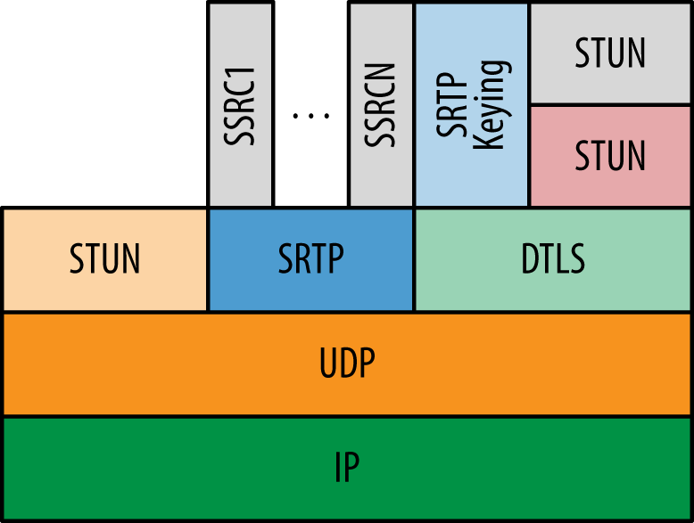

## webRTC

三个核心概念 `MediaStream`、`PeerConnection`、`DataChannel`

1. 本地和远程音频和视频的获取和管理：
	
	- MediaStream 界面（以及 HTML5 <audio> 和 <video> 标签的相关用法）

2. 连接管理：
	
	- RTCPeerConnection 接口

3. 管理任意数据：

	- RTCDataChannel 接口

### WebRTC 的 10 个步骤

以下 10 个步骤的步骤描述了 WebRTC API 的典型使用场景：

1. 从本地设备（如麦克风、网络摄像头）创建一个 MediaStream 对象。
1. 从本地 MediaStream 获取 URL Blob
1. 使用获取的 URL Blob 进行本地预览
1. 创建一个 RTCPeerConnection 对象
1. 将本地流添加到新创建的连接
1. 将你自己的会话描述发送到远程对等点 Send your own session description to the remote peer.
1. 从您的对等方接收远程会话描述 Receive the remote session description from your peer.
1. 处理收到的会话描述，并将远程流添加到您的 RTCPeerConnection
1. 从远程流获取 URL Blob
1. 使用获取的 URL Blob 播放远程对等方的音频和/或视频

### MediaStream

> `MediaStream` 是音频和/或视频的实际数据流的抽象表示。 它用作管理媒体流操作的句柄，例如显示媒体流的内容，对其进行记录或将其发送到远程对等方。 `MediaStream` 可以扩展为表示来自（远程流）或发送到（本地流）远程节点的流。

> 单个 MediaStream 可以包含零个或多个轨道。 每个轨道都有一个对应的 MediaStreamTrack 对象，该对象代表用户代理中的特定媒体源。 MediaStream 中的所有轨道在渲染时进行同步。MediaStreamTrack 表示包含一个或多个通道的内容，其中，通道之间具有定义的已知的关系。 

### PeerConnection

> `PeerConnection` 允许两个用户在浏览器之间直接通信。

### DataChannel

> `DataChannel` API旨在提供通用传输服务，允许Web浏览器以双向对等方式交换通用数据。

## 资料
- [WebRTC 实时通信](https://a-wing.github.io/webrtc-book-cn/02_handling-media-in-the-browser.html)
- [Real time communication with WebRTC](https://codelabs.developers.google.com/codelabs/webrtc-web)
- [Real time communication with WebRTC](https://webrtc.github.io/samples/)
- [MediaStream API](https://developer.mozilla.org/zh-CN/docs/Web/API/Media_Streams_API)